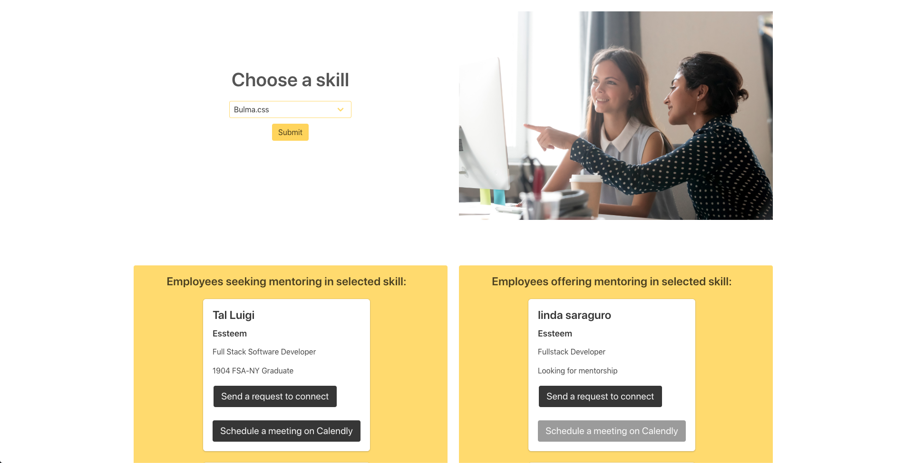

# Elevate

### Video Presentation:

### Deployed Web App:

https://elevateus.herokuapp.com

### Description:

Responsive web app that connects women in entry to mid-level tech roles with executives across various industries through inclusive reverse mentoring.

MVP completed using Agile methodologies in 14 days for the Essteem Hackathon for Gender Equality sponsored by Nasdaq and Capital One, [in which it won first place](https://www.equalithon.io/past-challenges/project-one-6dt56).

### Tech Stack:

Built using the NERDS stack and utilizes Bulma.css, Nodemailer, and Calendly.

### Dev Team:

* Macarena Carreno ([LinkedIn](https://www.linkedin.com/in/mcarrenog) | [GitHub](https://github.com/macarenacarreno))
* Linda Saraguro ([LinkedIn](https://www.linkedin.com/in/linda-saraguro-123524122) | [GitHub](https://github.com/saragurol))
* Jocelyn Jeriah ([LinkedIn](https://www.linkedin.com/in/jocelynjeriah) | [GitHub](https://github.com/luminousbeam))
* Tal Luigi ([LinkedIn](https://www.linkedin.com/in/talluigi) | [GitHub](https://github.com/luigilegion))
* Sam Peach ([LinkedIn](https://www.linkedin.com/in/sam-peach) | [GitHub](https://github.com/sam-peach))
